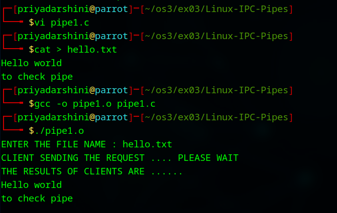
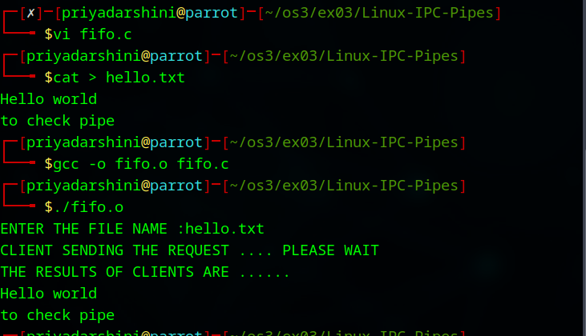

# Linux-IPC--Pipes
Linux-IPC-Pipes


# Ex03-Linux IPC - Pipes

# AIM:
To write a C program that illustrate communication between two process using unnamed and named pipes

# DESIGN STEPS:

### Step 1:

Navigate to any Linux environment installed on the system or installed inside a virtual environment like virtual box/vmware or online linux JSLinux (https://bellard.org/jslinux/vm.html?url=alpine-x86.cfg&mem=192) or docker.

### Step 2:

Write the C Program using Linux Process API - pipe(), fifo()

### Step 3:

Testing the C Program for the desired output. 

# PROGRAM:

## C Program that illustrate communication between two process using unnamed pipes using Linux API system calls
```
#include <stdio.h>
#include <stdlib.h>
#include <sys/types.h>
#include <sys/stat.h>
#include <string.h>
#include <fcntl.h>
#include <unistd.h>
#include <sys/wait.h>

void server(int, int);
void client(int, int);

int main() {
    int p1[2], p2[2], pid;

    pipe(p1);
    pipe(p2);
    pid = fork();

    if (pid == 0) {
        // Child process - acts as SERVER
        close(p1[1]);  // Close write end of pipe1
        close(p2[0]);  // Close read end of pipe2
        server(p1[0], p2[1]);
        exit(0);
    } else {
        // Parent process - acts as CLIENT
        close(p1[0]);  // Close read end of pipe1
        close(p2[1]);  // Close write end of pipe2
        client(p1[1], p2[0]);
        wait(NULL);
    }
    return 0;
}

void server(int read_fd, int write_fd) {
    int n;
    char fname[200], buff[2000];

    // Read filename from pipe
    n = read(read_fd, fname, sizeof(fname));
    fname[n] = '\0';

    int fd = open(fname, O_RDONLY);
    if (fd < 0) {
        write(write_fd, "Cannot open file", 16);
    } else {
        n = read(fd, buff, sizeof(buff));
        write(write_fd, buff, n);
        close(fd);
    }
}

void client(int write_fd, int read_fd) {
    int n;
    char fname[200], buff[2000];

    printf("ENTER THE FILE NAME : ");
    scanf("%s", fname);

    printf("CLIENT SENDING THE REQUEST .... PLEASE WAIT\n");

    write(write_fd, fname, strlen(fname));

    n = read(read_fd, buff, sizeof(buff));
    buff[n] = '\0';

    printf("THE RESULTS OF CLIENTS ARE ......\n");
    printf("%s\n", buff);
}
```

## OUTPUT
]

## C Program that illustrate communication between two process using named pipes using Linux API system calls
```

#include <stdio.h>
#include <stdlib.h>
#include <unistd.h>
#include <fcntl.h>
#include <sys/stat.h>
#include <string.h>

#define FIFO_FILE "myfifo"

void server(char filename[]);
void client();

int main()
{
    char filename[50];
    pid_t pid;

    printf("ENTER THE FILE NAME :");
    scanf("%s", filename);

    // Create FIFO if not exists
    mkfifo(FIFO_FILE, 0666);

    pid = fork();

    if (pid > 0)
    {
        sleep(1); // Give time for client to start
        server(filename);
    }
    else if (pid == 0)
    {
        client();
    }
    else
    {
        perror("fork");
        exit(1);
    }

    return 0;
}

/* SERVER PROCESS - writes file content to FIFO */
void server(char filename[])
{
    int fd1, fd2;
    char buffer[1000];
    FILE *fp;

    printf("CLIENT SENDING THE REQUEST .... PLEASE WAIT\n");

    fp = fopen(filename, "r");
    if (fp == NULL)
    {
        perror("Error opening file");
        exit(1);
    }

    fd1 = open(FIFO_FILE, O_WRONLY);
    if (fd1 < 0)
    {
        perror("Error opening FIFO");
        exit(1);
    }

    while (fgets(buffer, sizeof(buffer), fp) != NULL)
    {
        write(fd1, buffer, strlen(buffer));
    }

    fclose(fp);
    close(fd1);
}

/* CLIENT PROCESS - reads from FIFO and prints to screen */
void client()
{
    int fd2;
    char buffer[1000];
    ssize_t n;

    fd2 = open(FIFO_FILE, O_RDONLY);
    if (fd2 < 0)
    {
        perror("Error opening FIFO");
        exit(1);
    }

    printf("THE RESULTS OF CLIENTS ARE ......\n");

    while ((n = read(fd2, buffer, sizeof(buffer) - 1)) > 0)
    {
        buffer[n] = '\0';
        printf("%s", buffer);
    }

    close(fd2);
}

```

## OUTPUT
]


# RESULT:
The program is executed successfully.
